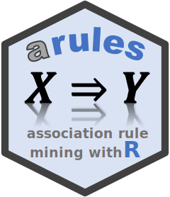

#  R package arulesCBA - Classification Based on Association Rules

[](https://CRAN.R-project.org/package=arulesCBA)
[](https://CRAN.R-project.org/package=arulesCBA)
 [](https://mhahsler.r-universe.dev/arulesCBA)

The R package [arulesCBA](https://cran.r-project.org/package=arulesCBA)
([Hahsler et al. 2019](#ref-Hahsler.Johnson.ea:2019)) is an extension of
the package [arules](https://cran.r-project.org/package=arules)
([Hahsler, Grün, and Hornik 2005](#ref-Hahsler.Grün.ea:2005)) to perform
association rule-based classification. The package provides the
infrastructure for class association rules and implements associative
classifiers based on the following algorithms:

- **CBA**: Classification Based on Association Rules ([Liu, Hsu, and Ma
  1998](#ref-Liu.Hsu.ea:1998)).
- **CMAR**: Classification based on Multiple Association Rule ([Li, Han,
  and Pei 2001](#ref-Li.Han.ea:2001)) via LUCS-KDD Software Library.
- **CPAR**: Classification based on Predictive Association Rules ([Yin
  and Han 2003](#ref-Yin.Han:2003)) via LUCS-KDD Software Library.
- **C4.5**: Rules extracted from a C4.5 decision tree ([J. Ross Quinlan
  1993](#ref-Quinlan:1993)) via J48 in R/Weka.
- **FOIL**: First-Order Inductive Learner ([J. R. Quinlan and
  Cameron-Jones 1993](#ref-Quinlan.Cameron-Jones:1993); [Yin and Han
  2003](#ref-Yin.Han:2003)).
- **PART**: Rules from Partial Decision Trees ([Frank and Witten
  1998](#ref-Frank.Witten:1998)) via R/Weka.
- **PRM**: Predictive Rule Mining ([Yin and Han
  2003](#ref-Yin.Han:2003)) via LUCS-KDD Software Library.
- **RCAR**: Regularized Class Association Rules using Logistic
  Regression ([Azmi, Runger, and Berrado
  2019](#ref-Azmi.Runger.ea:2019)).
- **RIPPER**: Repeated Incremental Pruning to Produce Error Reduction
  ([Cohen 1995](#ref-Cohen:1995)) via R/Weka.

The package also provides the infrastructure for associative
classification (supervised discetization, mining class association rules
(CARs)), and implements various association rule-based classification
strategies (first match, majority voting, weighted voting, etc.). Some
algorithms are interfaced by the R package R/Weka ([Hornik, Buchta, and
Zeileis 2009](#ref-Hornik.Buchta.ea:2009)) and the LUCS-KDD Software
Library ([Coenen 2013](#ref-Coenen:2013)).

The following R packages use `arulesCBA`:
[arules](https://CRAN.R-project.org/package=arules),
[qCBA](https://CRAN.R-project.org/package=qCBA),
[tidybins](https://CRAN.R-project.org/package=tidybins)

To cite package ‘arulesCBA’ in publications use:

> Hahsler M, Johnson I, Kliegr T, Kuchař J (2019). “Associative
> Classification in R: arc, arulesCBA, and rCBA.” *The R Journal*, *11*,
> 254-267. ISSN 2073-4859, <doi:10.32614/RJ-2019-048>
> <https://doi.org/10.32614/RJ-2019-048>.

    @Article{,
      title = {{Associative Classification in R: arc, arulesCBA, and rCBA}},
      author = {Michael Hahsler and Ian Johnson and Tom{\'{a}}\v{s} Kliegr and Jaroslav Kucha\v{r}},
      year = {2019},
      journal = {{The R Journal}},
      volume = {11},
      issue = {2},
      pages = {254-267},
      issn = {2073-4859},
      doi = {10.32614/RJ-2019-048},
    }

## Installation

**Stable CRAN version:** Install from within R with

``` r
install.packages("arulesCBA")
```

**Current development version:** Install from
[r-universe.](https://mhahsler.r-universe.dev/arulesCBA)

``` r
install.packages("arulesCBA",
    repos = c("https://mhahsler.r-universe.dev",
              "https://cloud.r-project.org/"))
```

## Usage

``` r
library("arulesCBA")
data("iris")
```

Learn a classifier.

``` r
classifier <- CBA(Species ~ ., data = iris)
classifier
```

    ## CBA Classifier Object
    ## Formula: Species ~ .
    ## Number of rules: 6
    ## Default Class: versicolor
    ## Classification method: first  
    ## Description: CBA algorithm (Liu et al., 1998)

Inspect the rulebase.

``` r
inspect(classifier$rules, linebreak = TRUE)
```

    ## Warning in seq.default(length = NCOL(quality)): partial argument match of
    ## 'length' to 'length.out'

    ##     lhs                            rhs                  support confidence coverage lift count size coveredTransactions totalErrors
    ## [1] {Petal.Length=[-Inf,2.45)}  => {Species=setosa}        0.33       1.00     0.33  3.0    50    2                  50          50
    ## [2] {Sepal.Length=[6.15, Inf],                                                                                                     
    ##      Petal.Width=[1.75, Inf]}   => {Species=virginica}     0.25       1.00     0.25  3.0    37    3                  37          13
    ## [3] {Sepal.Length=[5.55,6.15),                                                                                                     
    ##      Petal.Length=[2.45,4.75)}  => {Species=versicolor}    0.14       1.00     0.14  3.0    21    3                  21          13
    ## [4] {Sepal.Width=[-Inf,2.95),                                                                                                      
    ##      Petal.Width=[1.75, Inf]}   => {Species=virginica}     0.11       1.00     0.11  3.0    17    3                   5           8
    ## [5] {Petal.Width=[1.75, Inf]}   => {Species=virginica}     0.30       0.98     0.31  2.9    45    2                   4           6
    ## [6] {}                          => {Species=versicolor}    0.33       0.33     1.00  1.0   150    1                  33           6

Make predictions for the first few instances of iris.

``` r
predict(classifier, head(iris))
```

    ## [1] setosa setosa setosa setosa setosa setosa
    ## Levels: setosa versicolor virginica

## References

<div id="refs" class="references csl-bib-body hanging-indent"
entry-spacing="0">

<div id="ref-Azmi.Runger.ea:2019" class="csl-entry">

Azmi, Mohamed, George C. Runger, and Abdelaziz Berrado. 2019.
“Interpretable Regularized Class Association Rules Algorithm for
Classification in a Categorical Data Space.” *Information Sciences* 483:
313–31. <https://doi.org/0.1016/j.ins.2019.01.047>.

</div>

<div id="ref-Coenen:2013" class="csl-entry">

Coenen, Frans. 2013. *The LUCS-KDD Software Library*. University of
Liverpool.

</div>

<div id="ref-Cohen:1995" class="csl-entry">

Cohen, William W. 1995. “Fast Effective Rule Induction.” In *Machine
Learning Proceedings 1995, Proceedings of the Twelfth International
Conference on Machine Learning*, 115–23. Elsevier.
<https://doi.org/10.1016/B978-1-55860-377-6.50023-2>.

</div>

<div id="ref-Frank.Witten:1998" class="csl-entry">

Frank, Eibe, and Ian H. Witten. 1998. “Generating Accurate Rule Sets
Without Global Optimization.” In *Proceedings of the Fifteenth
International Conference on Machine Learning*, 144–51. ICML ’98. San
Francisco, CA, USA: Morgan Kaufmann Publishers Inc.

</div>

<div id="ref-Hahsler.Grün.ea:2005" class="csl-entry">

Hahsler, Michael, Bettina Grün, and Kurt Hornik. 2005. “Arules - a
Computational Environment for Mining Association Rules and Frequent Item
Sets.” *Journal of Statistical Software* 14 (15): 1–25.
<https://doi.org/10.18637/jss.v014.i15>.

</div>

<div id="ref-Hahsler.Johnson.ea:2019" class="csl-entry">

Hahsler, Michael, Ian Johnson, Tomáš Kliegr, and Jaroslav Kuchař. 2019.
“<span class="nocase">Associative Classification in R: arc, arulesCBA,
and rCBA</span>.” *The R Journal* 11: 254–67.
<https://doi.org/10.32614/RJ-2019-048>.

</div>

<div id="ref-Hornik.Buchta.ea:2009" class="csl-entry">

Hornik, Kurt, Christian Buchta, and Achim Zeileis. 2009. “Open-Source
Machine Learning: R Meets Weka.” *Computational Statistics* 24 (2):
225–32. <https://doi.org/10.1007/s00180-008-0119-7>.

</div>

<div id="ref-Li.Han.ea:2001" class="csl-entry">

Li, Wenmin, Jiawei Han, and Jian Pei. 2001. “CMAR: Accurate and
Efficient Classification Based on Multiple Class-Association Rules.” In
*Proceedings of the 2001 IEEE International Conference on Data Mining*,
369–76. ICDM ’01. Washington, DC, USA: IEEE Computer Society.
<https://doi.org/10.1109/ICDM.2001.989541>.

</div>

<div id="ref-Liu.Hsu.ea:1998" class="csl-entry">

Liu, Bing, Wynne Hsu, and Yiming Ma. 1998. “Integrating Classification
and Association Rule Mining.” In *Proceedings of the Fourth
International Conference on Knowledge Discovery and Data Mining*, 80–86.
KDD’98. AAAI Press.

</div>

<div id="ref-Quinlan:1993" class="csl-entry">

Quinlan, J Ross. 1993. “C4.5: Programs for Machine Learning.” *Morgan
Kaufmann Publishers*.

</div>

<div id="ref-Quinlan.Cameron-Jones:1993" class="csl-entry">

Quinlan, J. R., and R. M. Cameron-Jones. 1993. “FOIL: A Midterm Report.”
In *Proceedings of the 6th European Conference on Machine Learning*,
1–20. ECML’93. Berlin, Heidelberg: Springer-Verlag.
<https://doi.org/10.1007/3-540-56602-3_124>.

</div>

<div id="ref-Yin.Han:2003" class="csl-entry">

Yin, Xiaoxin, and Jiawei Han. 2003. “CPAR: Classification Based on
Predictive Association Rules.” In *Proceedings of the SIAM International
Conference on Data Mining*, 369–76. San Franciso: SIAM Press.

</div>

</div>
